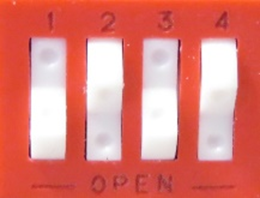

# STM32MP135F-DK AWS IoT Greengrass nucleus lite QuickStart
  

1. [Introduction](#1-introduction)
2. [Requirements](#2-requirements)

   * [Hardware](#hardware)
   * [Software](#software)
3. [Hardware Setup](#3-hardware-setup)
4. [/IOTCONNECT: Cloud Account Setup](#4-iotconnect-cloud-account-setup)
5. [/IOTCONNECT: Import the Device Template](#5-iotconnect-import-the-device-template)
6. [/IOTCONNECT: Create the Greengrass Device](#6-iotconnect-create-the-greengrass-device)
7. [Download and Write the Image](#7-download-and-write-the-image)
8. [Configure the Device](#8-configure-the-device)

   * [Obtain the IP Address](#obtain-the-ip-address)
   * [Transfer the Device Information](#transfer-the-device-information)
   * [Run the Setup Script](#run-the-setup-script)
9. [Deploy the Pre-Built Component](#9-deploy-the-pre-built-component)

   * [Load the Artifact](#load-the-artifact)
   * [Update and Load the Recipe](#update-and-load-the-recipe)
   * [Create Firmware](#create-firmware)
   * [Deploy Firmware](#deploy-firmware)
10. [Import a Dynamic Dashboard](#10-import-a-dynamic-dashboard)
11. [Resources](#11-resources)

## 1. Introduction
This guide will walk through the steps to create and demonstrate a Device Health Monitoring application solution on the STM32MP135F-DK.  The solution utilizes the new AWS Greengrass nucleus lite. Avnet's /IOTCONNECT platform will also be used to streamline all actions that would otherwise be performed in the AWS Console. The main tasks that will be performed are as follows:  

1. Create an /IOTCONNECT account
2. Import an example **Device Template** in /IOTCONNECT
3. Create a **Greengrass Device** in /IOTCONNECT
4. Setup **nucleus lite** on the target device
5. Download and Register a pre-built **Greengrass Component** in /IOTCONNECT
6. Create a **Firmware** package that defines the **Greengrass Components** deployed to the nucleus
7. Deploy the **Firmware** to the target device
8. View live data and interact with the target device using **Dynamic Dashboards** in /IOTCONNECT

## 2. Requirements
This guide has been written and tested to work on a Windows 10/11 PC to reach the widest audience.

### Hardware 
* STM32MP135F-DK [Purchase](https://www.avnet.com/shop/us/products/stmicroelectronics/stm32mp135f-dk-3074457345651659229/?srsltid=AfmBOopijKmQ00ko1YYwjONN5cRH9akfAf_aqdRSphwy7iE1XhpDUiG0) | [User Manual & Kit Contents](https://www.st.com/resource/en/user_manual/um2993-discovery-kit-with-1-ghz-stm32mp135fa-mpu-stmicroelectronics.pdf) | [All Resources](https://www.st.com/en/evaluation-tools/stm32mp135f-dk.html)
* 1 USB Type-C Cable
* 1 Micro-USB Cable
* Ethernet Cable

### Software
* A serial terminal such as [TeraTerm](https://github.com/TeraTermProject/teraterm/releases) or [PuTTY](https://www.putty.org/)
* Disk image writing software such as [BalenaEtcher](https://etcher.balena.io/)

## 3. Hardware Setup
Make the following connections using the image below as reference:
1. Connectivity: Connect an **Ethernet Cable** from your LAN (modem/router/switch) to the Ethernet connector labeled **#1**.
2. Power: Connect the **USB-C cable** from a 5V/2.4A power supply (could be your PC) to the PWR USB-C connector on the board, labeled **#2**.
3. Debug: Connect the Micro-USB cable from your PC to the Micro-USB connector labeled **#3** on the reference image.
See the reference image below for cable connections:  


## 4. /IOTCONNECT: Cloud Account Setup
An /IOTCONNECT account with an AWS backend is required.  If you need to create an account, a free trial subscription is available.
The free subscription may be obtained directly from [iotconnect.io](https://iotconnect.io) or through the AWS Marketplace.

* Option #1 (Recommended) /IOTCONNECT via [AWS Marketplace](https://github.com/avnet-iotconnect/avnet-iotconnect.github.io/blob/main/documentation/iotconnect/subscription/iotconnect_aws_marketplace.md) - 60 day trial; AWS account creation required
* Option #2 /IOTCONNECT via [iotconnect.io](https://subscription.iotconnect.io/subscribe?cloud=aws) - 30 day trial; no credit card required

> [!NOTE]
> Be sure to check any SPAM folder for the temporary password after registering.

## 5. /IOTCONNECT: Import the Device Template
1. Download the pre-made Device Template: [all-apps-device-template.json](../examples/common/files/all-apps-device-template.json)
2. Using the Sidebar menu in /IOTCONNECT, Navigate to *Device -> Greengrass Device -> Template (bottom menu)*.
3. Click on the **Create Template** button and then the **Import** button and browse to select the device template .json file.

## 6. /IOTCONNECT: Create the Greengrass Device
1. At the bottom of the /IOTCONNECT GUI, click the **Devices**
2. At the top-right, click **Create Device**  
3. Enter `STM32MP135F` for the **Unique ID** and **Device Name**  
4. Select the **Entity** to put the device in (For new accounts, there is only one option)  
5. Select `ggsdkdemo` for the **Template**  
6. Select `nucleus lite` for the **Device Type**
7. Click **Save & View**
8. Download the "Device Bundle" by clicking the icon in the upper right of the device page.  This contains information about the device which will be used to configure the board in a future step.  

## 7. Download and Write the Image
Avnet has created a pre-built image for the STM32MP135F-DK which can be directly written to the SD card provided with the board.
>[!NOTE]
> The image provided below is based on the ST StarterPackage version v6.0.0 for the STM32MP13 series. Please review [Section 6 of the ST StarterPackage Guide](https://wiki.st.com/stm32mpu/wiki/STM32MP13_Discovery_kits_-_Starter_Package) for more information on the binaries compatible with this development board.
1. Download and unzip the image :  [stm32mp135f-dk-sdcard-6.6-yocto-scarthgap-mpu-v24.11.06.zip](https://downloads.iotconnect.io/partners/st/disk-images/stm32mp135f-dk/stm32mp135f-dk-sdcard-6.6-yocto-scarthgap-mpu-v24.11.06.zip)  
2. Open Balena Etcher and Write the Image to the SD card
3. Ensure the Boot Switches are set as follows:  
   * BOOT0 = ON
   * BOOT1 = OFF
   * BOOT2 = ON
   * (Bottom switch is not connected so either position is OK)

4. Insert the SD card into the board and power it on

## 8. Configure the Device
Configuration of the device is mostly automated by using a device setup script, but first the device information bundle needs to be transferred to the board.
The steps required are as follows:
1. Obtain the IP address of the board
2. Transfer the device information to the board
3. Run the setup script

### Obtain the IP Address
There are a variety of ways to obtain the IP Address, but the most common are:
* Reference the DHCP table in your modem/router
* Connect to the board using a serial terminal, such as TeraTerm, and use the command `ifconfig`

### Transfer the Device Information
* Navigate to the directory where the device bundle file ("STM32MP135F-bundles.zip") was saved.
* **Right-Click** and select *Open in Terminal**
* Copy/Paste the following command replacing x.x.x.x with the IP address of the board
```commandline
scp STM32MP135F-bundles.zip root@x.x.x.x:
```

### Run the Setup Script
* If not already open, launch TeraTerm and connect to the board using the serial interface.
* Copy/Paste the following command to download the setup script and execute it.
```commandline
wget https://raw.githubusercontent.com/avnet-iotconnect/iotc-python-greengrass-sdk/refs/heads/main/installer/openstlinux/device-setup.sh -O device-setup.sh
```
> [!NOTE]
> This script will set up the development environment and precompile Python packages and may take around 7 minutes.

* Once the script has completed, use the following command to configure the device information:
```bash
bash device-setup.sh ~/STM32MP135F-bundles.zip
```

## 9. Deploy the Pre-Built Component
To deploy the pre-built component, we'll use /IOTCONNECT to create a firmware package that contains the artifact file and a recipe.
* **Download** and **Extract** the *Device Health Monitoring Component*: [iotc-gg-component-dhm-demo-2.0.0.zip](https://downloads.iotconnect.io/greengrass/components/iotc-gg-component-dhm-demo-2.0.0.zip)

### Load the Artifact
1. In the /IOTCONNECT platform, click **Firmware** at the bottom of the screen, then click **Components** at the top.
2. Select the artifact file ("dhm-demo-2.0.0.zip") from the previously extracted component archive here:  `<your working directory>\dhm-demo\greengrass-build\artifacts\io.iotconnect.example.IotConnectSdkDhmDemo\2.0.0\`
3. Ensure the artifact file is listed in the *Artifact List* and click the copy icon to the left of the filename. This will be used in the next step.  


### Update and Load the Recipe 
1. Open the `<your working directory>\dhm-demo\greengrass-build\recipes\recipe.yaml` file a in a text editor.
2. Navigate to the *Manifests* -> *Artifacts* ->  *Uri* section (line 33) and paste in the file path copied from the previous step.
3. **Save** and **Close** the file.
4. Return to the /IOTCONNECT window and upload the `recipe.yaml` to the *Recipe* field.
5. Click **Save**

### Create Firmware
1. Return to the **Firmware** tab and click **Create Firmware**
2. Enter a *Name*
3. Select the `ggsdkdemo` Template
4. Select the **Custom Component** in the drop-down
5. Click **Save**

### Deploy Firmware
1. **Click** *Deployments*
2. Add a *Name* and select each item in the drop-downs (there will only be one option for each)
3. Ensure you tick the box under "Components" and pick the version `2.0.0`
4. **Click** *Deploy*

The Firmware with the component is now deployed on the device.

## 10. Import a Dynamic Dashboard
/IOTCONNECT Dynamic Dashboards are an easy way to visualize data and interact with edge devices.  
* Download the *Device Health Monitoring* dashboard: [greengrass_nucleus_lite_STM32MP135F_dashboard.json](greengrass_nucleus_lite_STM32MP135F_dashboard.json)

* Switch back to the /IOTCONNECT browser window and verify the device status is displaying as `Connected`
* **Click** `Create Dashboard` from the top of the page
* **Select** the `Import Dashboard` option and select `ggsdkdemo` for **template** and your device name for **device** 
* **Enter** a name (such as `My STM32MP135 Greengrass Dashboard`) and complete the import

You will now be in the dashboard edit mode. You can add/remove widgets or just click `Save` in the upper-right corner to exit the edit mode.

## 11. Resources
* Learn more in the [iotc-python-greengrass-sdk](https://github.com/avnet-iotconnect/iotc-python-greengrass-sdk) repository.
* [Purchase the STM32MP135F-DK](https://www.avnet.com/shop/us/products/stmicroelectronics/stm32mp135f-dk-3074457345659849803/?srsltid=AfmBOopquBKia0rOHMSNs21TNvnk7RXm224OmsFITHs0A9LhuKjX4zHK)
* [More /IOTCONNECT ST Guides](https://avnet-iotconnect.github.io/partners/st/)
* [/IOTCONNECT Overview](https://www.iotconnect.io/)
* [/IOTCONNECT Knowledgebase](https://help.iotconnect.io/)
